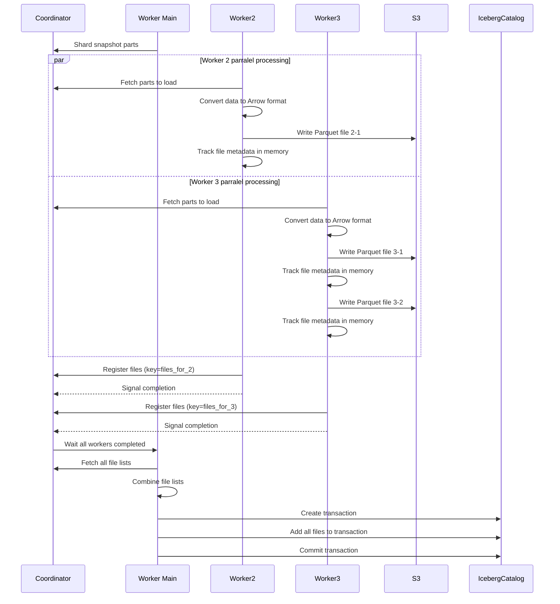

# Iceberg Snapshot Sink Design

## Overview

The Iceberg Snapshot Sink is a component of the Iceberg Provider in the Transferia ecosystem. It's designed to efficiently handle data ingestion in snapshot mode, converting incoming data into Parquet files stored in a distributed manner, with later consolidation into an Iceberg table.

## Architecture

### Key Components

1. **SinkSnapshot**: Implements the abstract Sinker interface, handling data ingestion in snapshot mode.
2. **Coordinator**: Manages state between distributed workers.
3. **Transaction Model**: Uses Iceberg's transaction capabilities to ensure atomic updates.

## Data Flow

The workflow follows these steps:

1. **Data Ingestion**: Each worker receives data via the Push method.
2. **Parquet File Creation**: Data is converted to Arrow format and written to Parquet files.
3. **File Tracking**: Each worker keeps track of files it creates in memory.
4. **File Registration**: Upon completion, workers register their files with the coordinator.
5. **Final Commit**: When all workers finish, files are collected and committed to the Iceberg table.

### Sharded Sequence Diagram

**Description of the Sharded Upload Process:**

The sharded data upload process to an Iceberg table works as follows:
1. The Main Worker divides the data into shards and notifies the Coordinator about this division.
2. Multiple worker processes (Worker2, Worker3, etc.) request data portions from the Coordinator in parallel for processing.
3. Each worker independently processes its received data, converts it to Arrow format, and writes it to Parquet files in S3 storage.
4. Workers track metadata of created files in memory and register them with the Coordinator upon completion.
5. After all workers have completed their tasks, the Main Worker retrieves the list of all files from the Coordinator, creates a transaction in the Iceberg catalog, and performs the final commit.

This approach provides efficient parallel data processing with atomic result committal, ensuring data integrity.

## Implementation Details

### Worker Initialization

Each worker is initialized with:
- Configuration for the Iceberg catalog
- Reference to the coordinator
- A unique worker number from the transfer job
- In-memory storage for tracking created files

When a worker starts, it creates a connection to the Iceberg catalog system (either REST-based or Glue-based) and prepares to handle incoming data.

### Parquet File Creation

For each batch of data:

1. The worker organizes the data by table
2. For each table, it creates a new Parquet file with a unique name
3. The data is converted to Apache Arrow format for efficient processing
4. The Arrow data is written to a Parquet file in the underlying storage system
5. The path to the file is stored in the worker's memory

The file naming system ensures uniqueness by incorporating:
- The configured storage prefix
- The table's namespace and name
- A sequential insert number
- A random UUID
- The worker's unique ID

This prevents filename collisions even when multiple workers process data simultaneously.

### File Tracking

Each worker maintains an in-memory list of all the files it has created. A mutex is used to ensure thread safety when appending to this list. This allows the worker to keep track of its contribution to the overall dataset.

### Completion and Coordination

When a worker finishes processing its portion of the data, it receives a completion signal and then:

1. Stores its file list in the coordinator under a unique key based on its worker number
2. The key format is "files_for_X" where X is the worker's number
3. The coordinator makes this information available to all workers

### Final Commit

When all workers have completed (marked by a special completion event), one designated worker:

1. Fetches all file lists from the coordinator by looking for keys that match the "files_for_X" pattern
2. Combines all the file paths into a single list
3. Ensures the target table exists, creating it if necessary
4. Creates a new Iceberg transaction
5. Adds all files to the transaction
6. Commits the transaction to finalize the snapshot

This final step ensures that all data becomes visible to readers in a single atomic operation, providing consistency guarantees.

## Benefits of This Design

1. **Scalability**: Multiple workers can process data in parallel, each creating files independently.
2. **Failure Resilience**: Files are only committed to the table after all workers successfully complete their processing.
3. **Atomicity**: The final commit is an atomic operation, ensuring consistent views of the data.
4. **Efficiency**: Data is written in the columnar Parquet format, providing excellent compression and query performance.
5. **Compatibility**: The implementation follows the Iceberg table format standards and best practices.

## Limitations and Future Improvements

1. **Recovery Mechanism**: A more robust failure recovery mechanism could be implemented for partially completed transfers.
2. **Optimized File Size**: Additional logic could control file sizes for optimal Iceberg performance.
3. **Schema Evolution**: Support for schema evolution during data transfer would enhance flexibility.
4. **Partitioning Strategy**: Smarter partitioning of data across files would improve query performance. 
