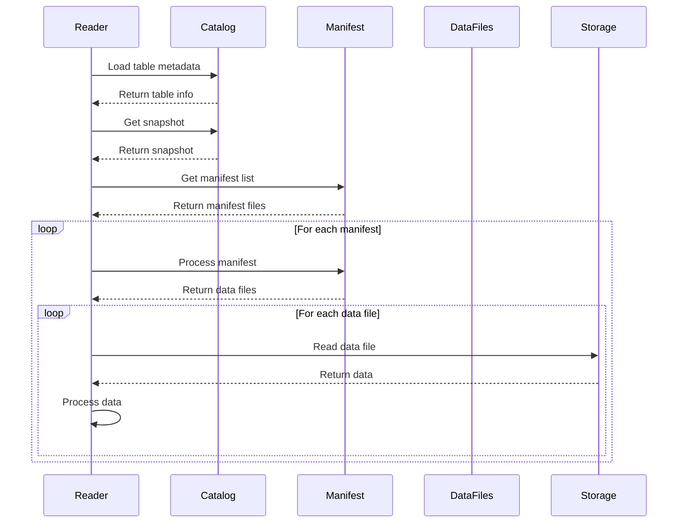

# Iceberg Table Reading Design

## Overview

The Iceberg Table Reading component is a fundamental part of the Iceberg Provider in the Transferia ecosystem. It's designed to efficiently handle data reading operations from Iceberg tables, supporting various reading patterns including snapshot reads, incremental reads, and time travel reads.

## Architecture

### Key Components

1. **Table Reader**: Manages the reading process from Iceberg tables
2. **Snapshot Manager**: Handles snapshot selection and validation
3. **Manifest Processor**: Processes manifest files and manages data file access
4. **Data File Reader**: Handles actual data file reading operations

## Data Flow

The reading workflow follows these steps:

1. **Table Loading**: Initialize table connection and load metadata
2. **Snapshot Selection**: Select appropriate snapshot based on reading requirements
3. **Manifest Processing**: Process manifest files to identify relevant data files
4. **Data Reading**: Read and process data from the identified files

### Reading Process Sequence Diagram

## Implementation Details

### Table Loading Process

1. **Initialization**
   - Connect to Iceberg catalog
   - Load table metadata
   - Initialize table properties
   - Set up schema information

2. **Configuration**
   - Set up reading parameters
   - Configure caching if enabled
   - Initialize resource limits

### Snapshot Selection

1. **Snapshot Types**
   - Current snapshot reading
   - Historical snapshot reading
   - Time travel reading
   - Incremental reading

2. **Snapshot Validation**
   - Verify snapshot existence
   - Check snapshot validity
   - Validate snapshot state

### Manifest Processing

1. **Manifest List Processing**
   - Retrieve manifest list
   - Filter manifests based on requirements
   - Process manifest entries

2. **Data File Identification**
   - Extract data file information
   - Apply partition filters
   - Prepare file reading plan

### Data Reading

1. **File Reading Strategy**
   - Parallel file reading
   - Batch processing
   - Resource management

2. **Data Processing**
   - Apply filters
   - Handle projections
   - Process results

## Benefits of This Design

1. **Flexibility**: Supports multiple reading patterns and use cases
2. **Efficiency**: Optimized for large-scale data reading
3. **Consistency**: Ensures data consistency through snapshot-based reading
4. **Scalability**: Can handle large datasets efficiently
5. **Reliability**: Robust error handling and recovery mechanisms

## Performance Considerations

1. **Optimization Techniques**
   - Partition pruning
   - Column projection
   - Batch size optimization
   - Caching strategies

2. **Resource Management**
   - Memory usage optimization
   - Connection pooling
   - Resource cleanup

## Error Handling

1. **Common Scenarios**
   - Missing snapshots
   - Corrupted manifests
   - File access errors
   - Network issues

2. **Recovery Mechanisms**
   - Retry logic
   - Fallback options
   - Error reporting

## Monitoring and Observability

1. **Key Metrics**
   - Read latency
   - Resource utilization
   - Cache effectiveness
   - Error rates

2. **Logging Strategy**
   - Operation tracking
   - Performance metrics
   - Error logging
   - Debug information

## Limitations and Future Improvements

1. **Current Limitations**
   - Memory constraints for large datasets
   - Network bandwidth requirements
   - Cache size limitations

2. **Potential Improvements**
   - Enhanced caching mechanisms
   - Better resource utilization
   - Improved error recovery
   - Advanced optimization techniques 