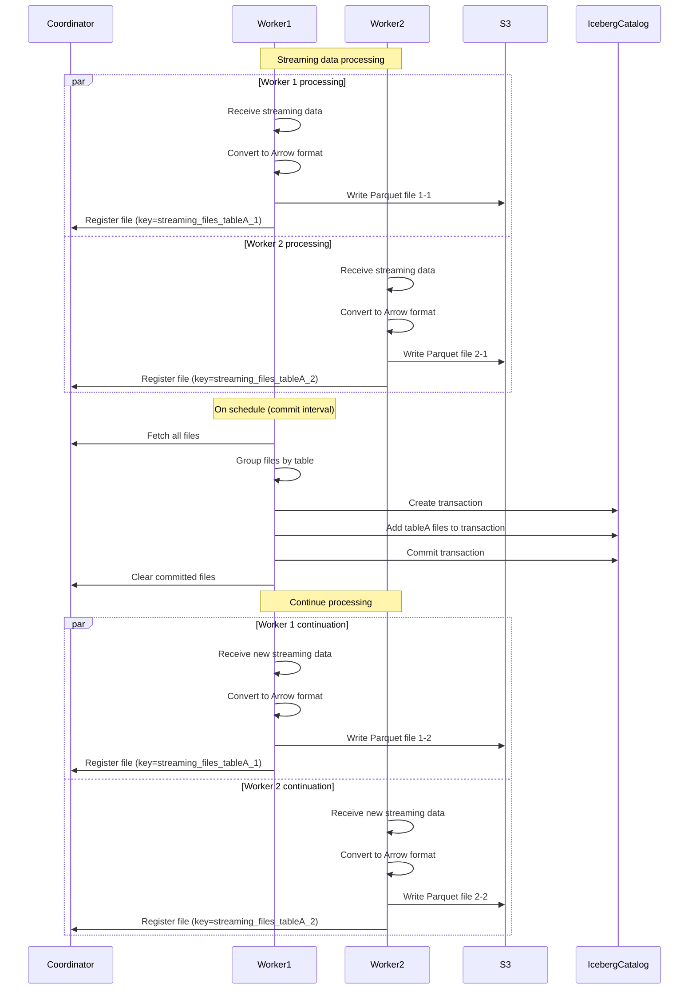

# Iceberg Streaming Sink Design

## Overview

The Iceberg Streaming Sink is a component of the Iceberg Provider in the Transferia ecosystem, designed to efficiently handle continuous data streams. Unlike the Snapshot Sink, it works with a continuous flow of changes, converting incoming data into Parquet files and periodically consolidating them into Iceberg tables.

## Architecture

### Key Components

1. **SinkStreaming**: Implements the abstract Sinker interface, handling continuous data ingestion.
2. **Coordinator**: Manages state between distributed workers.
3. **Commit Scheduler**: Periodically consolidates accumulated files into Iceberg tables.
4. **Transaction Model**: Uses Iceberg's transaction capabilities to ensure atomic updates.

## Data Flow

The workflow follows these steps:

1. **Data Ingestion**: Each worker receives data via the Push method.
2. **Parquet File Creation**: Data is converted to Arrow format and written to Parquet files.
3. **File Tracking**: Each worker tracks created files in memory and in the coordinator.
4. **Periodic Commits**: At configured intervals, the scheduler commits accumulated files to tables.
5. **State Cleanup**: After successful commits, information about committed files is removed from the coordinator.

### Streaming Process Diagram

**Description of the Streaming Upload Process:**

The streaming data upload process to an Iceberg table works as follows:
1. Multiple workers process streaming data in parallel.
2. Each worker independently converts data to Arrow format and writes it to Parquet files in storage.
3. Workers track metadata of created files in memory and register them with the coordinator.
4. At configured intervals, accumulated files are committed to Iceberg tables.
5. After commit, information about committed files is cleared.

## Implementation Details

### Worker Initialization

Each worker is initialized with:
- Configuration for the Iceberg catalog
- Reference to the coordinator
- A unique worker number from the transfer job
- In-memory storage for tracking created files
- Scheduler for periodic file commits to tables

When a worker starts, it creates a connection to the Iceberg catalog system (either REST-based or Glue-based) and prepares to handle incoming data.

### Parquet File Creation

For each batch of data:

1. The worker organizes the data by table
2. For each table, it creates a new Parquet file with a unique name
3. The data is converted to Apache Arrow format for efficient processing
4. The Arrow data is written to a Parquet file in the underlying storage system
5. The path to the file is stored in the worker's memory and in the coordinator

The file naming system ensures uniqueness by incorporating:
- The configured storage prefix
- The table's namespace and name
- A sequential insert number
- A random UUID
- The worker's unique ID

This prevents filename collisions even when multiple workers process data simultaneously.

### File Tracking

Each worker maintains an in-memory map where the key is the table identifier and the value is a list of files created for that table. A mutex is used to ensure thread safety when adding to this list. Information about files is also passed to the coordinator with a key format of "streaming_files_{tableID}_{workerNum}".

### Periodic Commits

Unlike snapshot mode, where commits happen only after the entire load is complete, in streaming mode:

1. A scheduler is started with the configured commit interval
2. At regular intervals, the following occurs:
   - File lists are retrieved from the coordinator
   - Files are grouped by table
   - A transaction is created for each table
   - Files are added to the transaction
   - The transaction is committed
   - Information about committed files is cleared

### Table Management

In streaming mode, there is no explicit handling of DROP and TRUNCATE events. Instead:

1. Tables are created when the first data arrives
2. Table objects are cached to improve performance
3. Checks for table existence are performed before each commit

## Benefits of This Design

1. **Data Freshness**: Regular commits ensure that data in Iceberg tables is updated with predictable latency.
2. **Scalability**: Multiple workers can process data in parallel, each creating files independently.
3. **Failure Resilience**: By storing metadata in the coordinator, the process can be recovered after a failure.
4. **Atomicity**: Each commit is an atomic operation, ensuring consistent views of the data.
5. **Efficiency**: Data is written in the columnar Parquet format, providing excellent compression and query performance.
6. **Compatibility**: The implementation follows the Iceberg table format standards and best practices.

## Limitations and Future Improvements

1. **File Size Control**: Additional logic could control file sizes for optimal Iceberg performance.
2. **Schema Evolution**: Support for schema evolution during data transfer would enhance flexibility.
3. **Partitioning Strategy**: Smarter partitioning of data across files would improve query performance.
4. **Guaranteed Delivery**: Implementing an acknowledgment mechanism for data processing would increase system reliability.
5. **Table Prioritization**: The ability to specify commit priorities for different tables. 